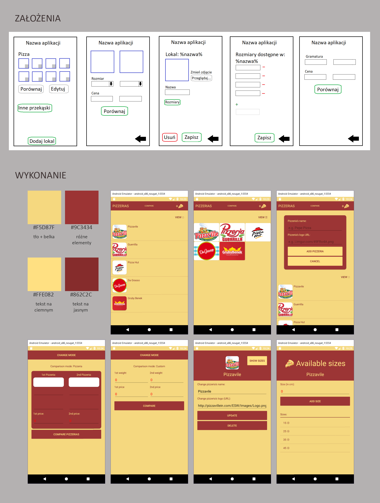

# FoodParty

## Projekt zrealizowany w ramach zadania uczelnianego

### Postawione wymagania dotyczące zaliczenia na ocenę:
```$xslt
- zastosowanie pełnego wzorca MVVM - binding wartości oraz "command"
- adaptatywny interface użytkownika - dotyczy zarówno geometrii jak i systemu operacyjnego
- wykorzystanie zdarzeń związanych z cyklem życia aplikacji - OnStart, OnSleep, OnResume
- wykorzystanie konstrukcji "DependencyService" do ujednolicenia asynchronicznego dostępu do plików
- dodatkowe właściwości (dwie z wymienionych): 
	- nawigacja stron z przekazywaniem wartości
	- walidacja danych na formularzach
	- zarządzanie konfiguracją aplikacji
	- dostęp do danych zdalnych (np.: REST) i wykorzystanie pamięci podręcznej (cache)
- usability
```

### Spełnione wymagania
```$xslt
- zastosowanie pełnego wzorca MVVM - binding wartości oraz "command"
- adaptatywny interface użytkownika - dotyczy zarówno geometrii jak i systemu operacyjnego
(przy tworzeniu layoutów używano StackLayout oraz relativeLayout z wykorzystaniem jedynie osi Y)
- wykorzystanie konstrukcji "DependencyService" do ujednolicenia asynchronicznego dostępu do plików
(dostęp do bazy danych)
- dodatkowe właściwości: 
	- nawigacja stron z przekazywaniem wartości
	(możliwe jest sprawdzenie detali dotyczących danego obiektu)
	- walidacja danych na formularzach
- usability
(ocenione pozytywnie przez prowadzącego)
```

### Opis projektu
```$xslt
Aplikacja o roboczej nazwie FoodParty umożliwia użytkownikowi dokonanie szybkiego porównania 
matematycznego, służącego do oszacowania opłacalności transakcji. Zorientowana głównie na pizze,
pozwala przeliczenie stosunku rozmiaru pizzy do ceny i porównanie opłacalności z drugą pizzerią.
Dodatkową opcją jest przeliczanie stosunku gramatury dowolnego produktu do jego ceny, również 
w trybie porównywania. Aplikacja ułatwia oszczędne dokonywanie zakupów, np. przy okazji 
planowania przyjęcia ze znajomymi.
Baza danych zawierająca szczegóły obiektów jest zapisywana lokanie, typu sqlite3.

Workflow:
- Ekran główny zawiera responsywną belkę z nazwą listy, przyciskiem "COMPARE" oraz przyciskiem 
w formie obrazka UNICODE przedstawiającego pizzę oraz listę pizzerii.
- Po kliknięciu w napis "COMPARE" na belce wyświetlany jest ekran porównywania. Domyślnie jest
zorientowany na pizzerie. Użytkownik za pomocą tapnięć wybiera kolejno pizzerie oraz rozmiary
pizz do nich przypisane. Po kliknięciu przycisku "COMPARE PIZZERIAS" w oknie pop-up wyświetlany 
jest komunikat o opłacalności danej opcji. Użytkownik może również przenieść się w tryb 
dowolny, klikając na napis "CHANGE MODE" na belce. W tym przypadku własnoręcznie wpisuje 
kolejno wagi oraz ceny porównywanych produktów.
- Z poziomu ekranu głównego użytkownik może również dodać nową pizzerię do bazy danych 
poprzez kliknięcie przycisku-obrazka pizzy. Na ekranie wysuwa się dodatkowy panel pozwalający
na dodanie nazwy pizzerii oraz adresu URL z jej logo, który następnie jest przetwarzany na obraz.
W przypadku niedodania adresu logo wyświetlany jest placeholder. 
- Użytkownik będąc na ekranie głównym możże również zmieniać sposób wyświetlania pizzerii.
Do wyboru ma formę listy oraz siatki.

Information flow:
- Z poziomu ekranu głównego użytkownik może, za pomocą tapnięcia, wybrać pizzerię. Jest wtedy
przenoszony na stronę dotyczącą daneogo obiektu; może tam edytować wprowadzone infomacje lub
usunąć lokal z bazy. 
- Z poziomu ekranu szczegółowego pizzerii dostępny jest przycisk "SHOW SIZES" (znajduje się
po prawej od zdjęcia), który przenosi użytkownika do ekranu zawierającego informacje dotyczące
rozmiarów pizzy dostępnych w danym lokalu. Użytkownik może je dodawać lub usuwać.
```

### Layout aplikacji
```$xslt
Layout aplikacji pokazuje założenia projektowe udostępnione na początku oraz wynik końcowy
na platformie Android.
```

